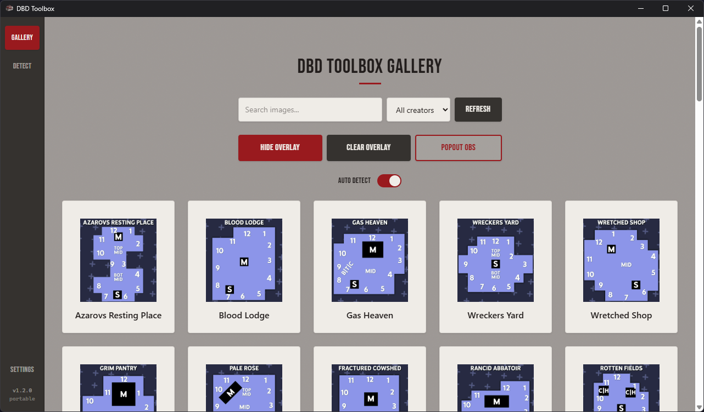
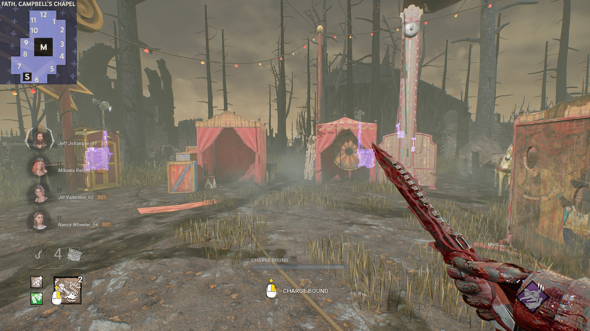

# DBD Toolbox

**Never blank on a map layout again.**

DBD Toolbox is a lightweight desktop companion for *Dead by Daylight*. It
watches your game window, reads the map name straight off the loading
screen, and instantly overlays the matching community-made callout image —
so you already know where the shack, jungle gyms, and pallet loops are
before you've even loaded in.

Built for players who stream, record, or just want an edge without alt-
tabbing to a wiki mid-loading-screen.

---

## Screenshots

<p align="center">
  
  
</p>

## Features

- 🔍 **Automatic map detection** — OCRs the loading screen in the
  background and matches it against a large library of map callout images.
  No manual searching, no guessing.
- 🖼️ **On-screen overlay** — a transparent, click-through, always-on-top
  window shows the matching callout image right on top of the game.
- 📹 **OBS-friendly** — capture the overlay directly as a game-capture
  source, or use the dedicated chroma-key pop-out window for a clean
  browser/window-capture source in your stream layout.
- 🗂️ **Community map gallery** — browse the full callout library by
  creator and map family, with a preferred-creator setting so your favorite
  callout artist is always matched first.
- ⚡ **Manual or automatic scanning** — trigger a scan with a global
  hotkey, on demand, or let auto-detect quietly re-scan on an interval.
- 🔄 **Always up to date** — the map pack syncs from GitHub automatically,
  so new maps and callouts arrive without an app update. The app itself
  can also check for and install updates in-app.
- 🎛️ **Fully configurable** — scan regions, hotkeys, overlay position,
  size and opacity are all tweakable from the Settings tab.

## How it works

1. A global hotkey (or the auto-detect loop) triggers a scan.
2. The app screenshots the game window and crops out the map-name region.
3. That crop is OCR'd locally (via `tesseract.js`) — nothing leaves your
   machine.
4. The recognized text is fuzzy-matched against the map callout library.
5. The matching image is pushed to the overlay window(s) instantly.

## Getting started

1. Download the latest installer from the
   [Releases page](https://github.com/ExeQOrg/dbd-toolbox/releases).
2. Launch DBD Toolbox — on first run it will download the current map
   callout pack.
3. Open **Settings** to set your scan hotkey, scan region(s), and overlay
   position to match your setup.
4. Add the overlay window as a source in OBS (game capture, or use the
   OBS pop-out for window/browser capture).
5. Head into a match — press your scan hotkey (or let auto-detect handle
   it) once the loading screen appears, and the callout image will pop
   up on your overlay.

A portable, no-install build is also available on the Releases page if you'd
rather not install anything.

## Map callouts

The callout images themselves live in [`Maps/`](./Maps) and are community
contributions, organized by creator and map family. The app pulls this
folder from GitHub at startup, so it's always current without needing a new
release. Want to contribute a callout set? Open a PR against this
repository's `Maps/` directory.

Want to use your own callouts without submitting them? Settings has an
**Open Custom Maps Folder** button that opens a separate `CustomMaps`
folder alongside the synced map pack. Drop images in there using the same
layout (`Creator/Map Name.png`, or `Creator/Family/Map Name.png`) and
they'll show up in the gallery and detection like any other map — this
folder is never touched by map pack syncs, so your own images won't get
wiped out by an update.

## Tech stack

DBD Toolbox is built with [Tauri 2](https://tauri.app/), pairing a small,
fast Rust backend (window capture, filesystem, global shortcuts, map sync)
with a React 19 + TypeScript + Tailwind frontend. See
[AGENTS.md](./AGENTS.md) for a deeper architectural tour if you're looking
to contribute code.

## Development

```bash
cd App
npm install
npm run tauri dev     # run the app locally
npm run build          # typecheck + build the frontend
npm run tauri build     # produce a full production build
```

Rust-only checks:

```bash
cd App/src-tauri
cargo check
```

## License

Licensed under the [GNU GPLv3](./LICENSE).
